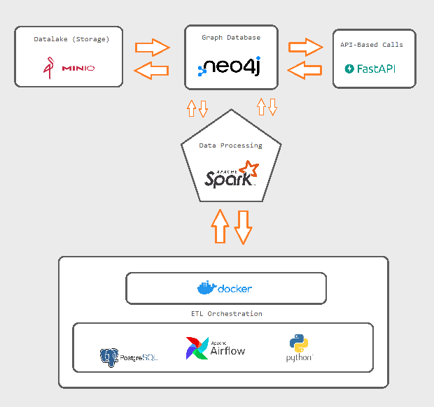

# Data Pipeline (ETL) with Neo4j - Airflow - Minio - Fastapi 


## Description

Data pipeline that extracts data from Uniprot, a large protein database, and stores it in a Neo4j graph database. The pipeline is implemented using Airflow, Docker, and Python. The data is downloaded from Uniprot in XML format, parsed using the Uniprot schema, and stored in Neo4j using the Neo4j Python driver. A basic REST API is provided to query the general information included in the data. The project is designed to be scalable and extensible, with the potential to add more data sources by implementing Spark and other tools such as Kafka for streaming and more in the future.

#

This project contains the following containers:

* Postgres: Postgres database for Airflow metadata 
    * Image: postgres:13
    * Database Port: 5432

* Airflow: Airflow webserver and Scheduler.
    * Image: apache/airflow:2.2.3
    * Port: 8080

* MiniO: Local Datalake
    * Image: postgres:13
    * Web console Port: 9000

* Neo4j: Postgres database for Airflow metadata 
    * Image: neo4j:4.4.0
    * Database Port: 7474

* FastAPI: Requests via API
    * Image: 0.95.0
    * Database Port: 8000

## File Structure

```bash
├── airflow
│   ├── dags
│   │   ├── parse_uniprot_xml.py
|   |   ├── uniprot_data_pipeline.py
│   ├── Dockerfile
│   ├── entrypoint.sh
│   └── requirements.txt
├── data
├── fastapi
│   │   ├── app.py
|   |   ├── Dockerfile
|   |   ├── requirements.txt
├── logs
├── minio
│   │   ├── Dockerfile
|   |   ├── requirements.txt
|   |   ├── setup.sh
└── docker-compose.yml
└── README.md
└── TODO
```

## Architecture components



## Setup

### Requirements
    
    $ Must have Docker installed on your machine. Ignore it if using CDE (Cloud Development Environment), i.e., Gitpod, GitHub Codespaces, etc

### Clone project

    $ git clone https://github.com/fernandodgl/weavebio

### Build containers

Inside the 'weavebio' folder (root)

    $ docker-compose build --no-cache

### Start containers

On the same path above:

    $ docker-compose up

If you want to run in background:

    $ docker-compose up -d

### Check if you can access:

|        Application        |URL                          |Credentials                         |
|----------------|-------------------------------|-----------------------------|
|Airflow| [http://localhost:8080](http://localhost:8080) | ``` User: admin``` <br> ``` Pass: password``` |         |
|Neo4j| **Database:** [http://localhost:7474](http://localhost:7474) | ``` User: neo4j``` <br> ``` Pass: password``` |         |
|MinIO| [http://localhost:9000](http://localhost:9000) | ``` User: admin``` <br> ``` Pass: password``` |           |
|FastAPI | [http://localhost:8000/docs](http://localhost:8000/docs)|  |         |
  

## References

[neo4j.com](https://neo4j.com/docs/ogm-manual/current/reference/)

[uniprot.org](https://www.uniprot.org/help/technical)

[airflow.apache.org](https://airflow.apache.org/docs/apache-airflow/stable/)

[min.io](https://min.io/docs/minio/linux/developers/go/API.html)

